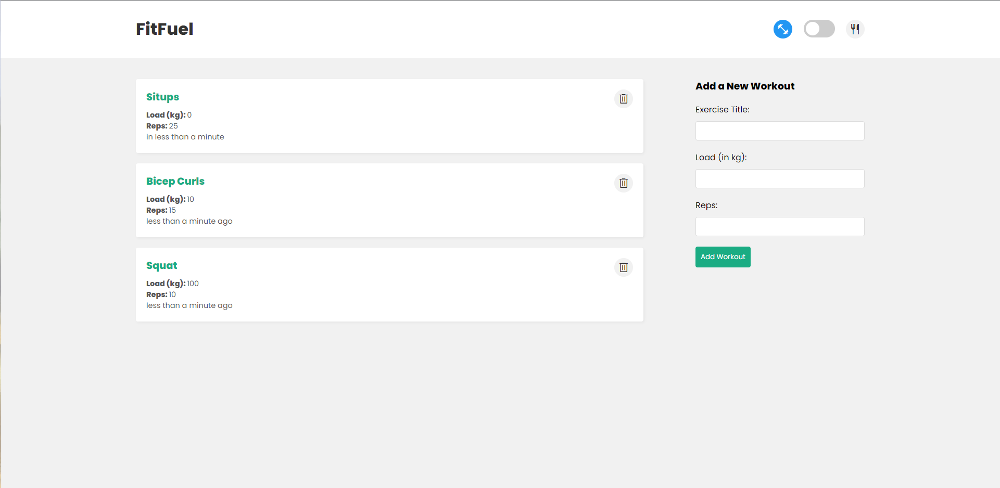
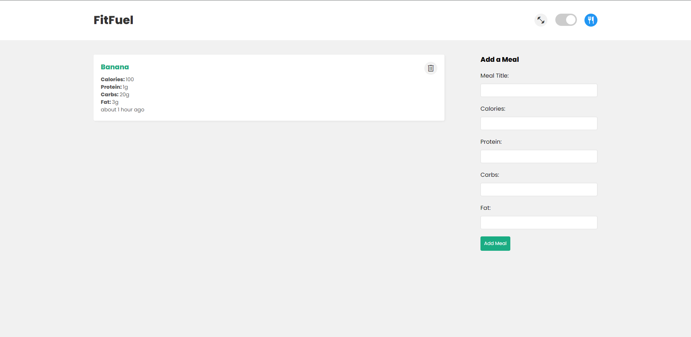
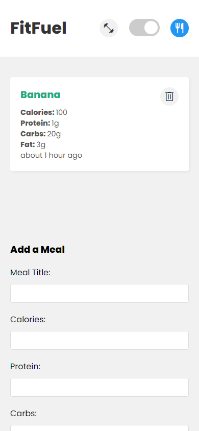

# FitFuel - Workout and Food Tracking App

FitFuel is your all in one app to track both your workouts and your meals!

View the deployed app here: https://fit-fuel.netlify.app/
View Code for the frontend here: https://github.com/ameer-ahmad/FitFuel-client
View Code for the backend here: https://github.com/ameer-ahmad/FitFuel-server

## Project Description

This full-stack web application allows users to plan and track their workouts and meals. The app features two main sections: a workout planner and a food planner. Users can easily switch between the two sections using a toggle, allowing them to quickly and easily plan and track their fitness and nutrition goals.

In the workout planner section, users can add exercises to their workout plan, along with details such as sets, reps, and weights. They can also view their existing workout plans, and delete exercises that they no longer want to include.

In the food planner section, users can add meals to their food plan, along with details such as calories, protein, carbs, and fat. They can also view their existing meal plans, and delete meals that they no longer want to include.

This app is perfect for anyone who wants to take control of their fitness and nutrition goals, and easily plan and track their progress in a single, easy-to-use application.

## Technologies Used

- React
- Node.js
- Express.js
- MongoDB
- Heroku
- Netlify

This full-stack web application was built using a combination of these technologies. React was used for the front-end development, while Node.js and Express.js were used to create the server and handle API requests. MongoDB was used as the database to store data. The application is hosted on Heroku for the backend and Netlify for the front-end.

Other technologies and tools used in the development of this project include:

- HTML/CSS
- JavaScript
- Git and GitHub for version control
- VS Code for code editing
- NPM for package management

## Future Ideas

While this app is already functional and useful, there are several features and improvements that could be added in the future to make it even better. Some possible ideas include:

- User authentication: Allow users to create an account and log in, so that their workout and meal plans are tied to their account and can be accessed from any device.
- User profiles: Create a user profile page where users can view their progress and statistics, such as the number of workouts completed, meals planned, and overall progress towards their fitness and nutrition goals.
- Social sharing: Allow users to share their workout and meal plans on social media, or to connect with friends and family to share progress and provide encouragement and support.
- Exercise library: Create a library of exercises with instructions and videos, so that users can easily find new exercises to add to their workout plans.
- Meal suggestions: Provide suggestions for meals based on the user's goals and dietary restrictions, using machine learning or other techniques to analyze their preferences and habits.
- Workout challenges: Create workout challenges or programs that users can follow to achieve specific goals, such as weight loss, muscle gain, or endurance training.
- Integration with fitness trackers: Allow users to sync their workout and meal data with popular fitness trackers, such as Fitbit or Apple Watch.

By implementing these and other features, this app could become an even more powerful tool for anyone who wants to take control of their fitness and nutrition goals, and achieve long-term success and health.

## Getting Started

To clone and run this app locally, you will need to have Git, Node.js, and MongoDB installed on your machine. Here are the steps you need to follow:

1. Clone the repository:
git clone https://github.com/ameer-ahmad/FitFuel.git

2. Install the dependencies:
cd FitFuel/backend
npm install

3. Create a `.env` file in the backend folder of the project and add the following environment variables:
PORT=4000
MONGODB_URI=<your-mongodb-uri>

4. Start the server:
npm run dev

5. Open another terminal and navigate to the client folder:
cd ../frontend

6. Install the dependencies:
npm install

7. Start the React app:
npm start

The app should now be running on `http://localhost:3000`. You can access the workout planner and food planner sections by toggling between them using the toggle button.

Note: Before running the app, make sure to replace `<your-mongodb-uri>` with your MongoDB URI. You can create a free account on [MongoDB Atlas](https://www.mongodb.com/cloud/atlas) to get a URI.

That's it! You now have a fully-functional copy of the app running on your own machine, and you can customize it and add your own features as desired.

## Screenshots

The Food section of the App

Mobile version of the App

